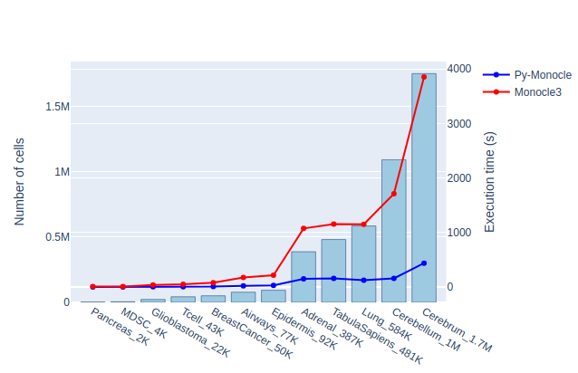
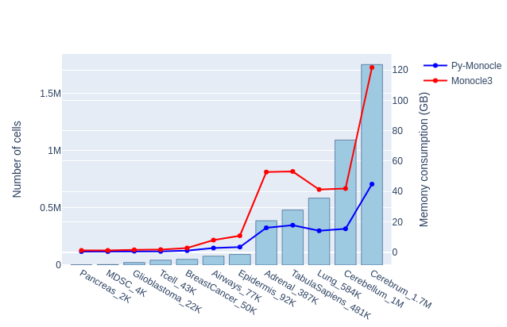

# MONOCLE3 PYTHON IMPLEMENTATION


# Installation:
```bash
git clone https://github.com/bioturing/py-monocle.git
python3 -m pip install py-monocle/.
```

# Testing:
```bash
cd py-monocle/extras/run
pip install -r requirements.txt
python3 -m precompute
python3 -m pytest test
```

# Benchmarking:
```bash
cd py-monocle/extras/benchmark
python3 prepare_datasets.py
python3 benchmark.py
```

# Report:

## Introduction:

We introduce [**``BioTuring Py-Monocle``**](https://github.com/bioturing/py-monocle.git), an algorithm that computes [``pseudotime``](https://www.nature.com/articles/s41586-019-0969-x) for large single-cell datasets. We implement the algorithm in Python based on [``Monocle3``](https://github.com/cole-trapnell-lab/monocle3) package from R, with optimized steps for enhanced efficiency. This package harnesses established Python libraries such as [``Numpy``](https://github.com/numpy/numpy), [``Pandas``](https://github.com/pandas-dev/pandas), [``Scipy``](https://github.com/scipy/scipy), [``scikit-learn``](https://github.com/scikit-learn/scikit-learn), and [``NetworkX``](https://github.com/networkx), etc., below, we outline the core concepts of the algorithm, detail our contributions, and provide benchmark results.

## Change / Optimization:

- **Minimum spanning tree:**

    In order to derive the minimum spanning tree (MST) from a list of
    centroids, instead of directly computing pairwise distances and
    constructing a complete graph, we opt to generate a k-nearest
    neighbor (k-NN) graph. This graph's connections represent the most
    favorable candidates for the MST. If the k-NN graph is connected, we
    can construct an MST from it. However, if it's not connected, we
    create individual MSTs for each connected component within the
    graph. Then, we introduce additional edges to link these components
    by identifying the shortest connections between them.

    This optimization strategy becomes particularly impactful as the
    number of cells increases. When dealing with order cells, computing
    the MST of projections from each cell to the principal graph
    requires significant memory and leads to longer execution times. As
    a result, the computational cost and runtime will noticeably
    escalate.

- **Computing order cells:**

    During the computation of the MST, projecting each cell onto the principal graph poses a challenge. Due to the projection method, multiple projections often share the same coordinates, resulting in some connection weights being zero, which might be mistakenly interpreted as no connection. In the original Monocle3 approach, a bias was introduced to address this issue by finding the minimum of nonzero distances. However, to maintain greater precision, we adopt ``NetworkX``

## Benchmarking result:

### Dataset description:

| **Study ID**                                                                                                                 | **Number of cells** |
| :--------------------------------------------------------------------------------------------------------------------------- | ------------------: |
| [``Pancreas_2K``](https://www.cell.com/cell-metabolism/pdf/S1550-4131(16)30436-3.pdf)                                        |               2,209 |
| [``MDSC_4K``](https://journals.lww.com/shockjournal/fulltext/2021/05000/single_cell_rna_seq_of_human_myeloid_derived.4.aspx) |               4,705 |
| [``Glioblastoma_22K``](https://www.nature.com/articles/s41467-020-17186-5)                                                   |              22,637 |
| [``Tcell_43K``](https://www.nature.com/articles/s41467-020-15543-y)                                                          |              43,112 |
| [``BreastCancer_50K``](https://www.nature.com/articles/s41591-021-01323-8)                                                   |              50,693 |
| [``Airways_77K``](https://www.atsjournals.org/doi/full/10.1164/rccm.201911-2199OC)                                           |              77,969 |
| [``Epidermis_92K``](https://www.cell.com/cell-reports/pdf/S2211-1247(18)31421-9.pdf)                                         |              92,889 |
| [``Adrenal_387K``](https://www.science.org/doi/full/10.1126/science.aba7721)                                                 |             387,771 |
| [``TabulaSapiens_481K``](https://www.science.org/doi/full/10.1126/science.abl4896)                                           |             481,120 |
| [``Lung_584K``](https://www.science.org/doi/full/10.1126/science.aba7721)                                                    |             584,884 |
| [``Cerebellum_1M``](https://www.science.org/doi/full/10.1126/science.aba7721)                                                |           1,092,000 |
| [``Cerebrum_1.7M``](https://www.science.org/doi/full/10.1126/science.aba7721)                                                |           1,751,246 |


  **``Table 1``**: describes the details of the benchmark datasets, including the dataset's IDs and number of cells in the cell-by-gene matrix.

### Benchmark results

We performed benchmark tests on the execution time and memory usage of both Py-Monocle and Monocle3 methods using their default parameters. However, we observed that enabling the ``close_loop`` option triggers the clustering method from another package, significantly increasing rapidly both time and memory usage. Hence, to ensure fairness in our comparison, we disable this option.

The benchmark results are shown in Table 2. Py-Monocle consistently shows its significant advantages in speed and RAM consumption. On a dataset of size 1.7 million cells, Py-Monocle finishes in 437 seconds, while Monocle3 takes 3850 seconds. Notably, Py-Monocle just consumes 44.8 GB RAM, while Monocle3 consumes 121.7 GB RAM. Among these 2 packages, Py-Monocle and Monocle3, and their comparison are also depicted in Figure 1.

| **Study ID**       | **Runtime Py-Monocle (s)** | **Runtime Monocle3 (s)** | **RAM Py-Monocle (GB)** | **RAM Monocle3 (GB)** |
| :----------------- | -------------------------: | -----------------------: | ----------------------: | --------------------: |
| Pancreas_2K        |                       0.73 |                     6.29 |                    0.34 |                  1.05 |
| MDSC_4K            |                       0.51 |                     7.92 |                    0.32 |                  1.04 |
| Glioblastoma_22K   |                       2.29 |                    36.32 |                    0.52 |                  1.47 |
| Tcell_43K          |                       2.38 |                    49.89 |                    0.48 |                  1.57 |
| BreastCancer_50K   |                       6.72 |                    80.30 |                    0.96 |                  2.68 |
| Airways_77K        |                      20.88 |                   174.27 |                    2.59 |                  7.86 |
| Epidermis_92K      |                      27.00 |                   214.67 |                    3.28 |                 10.76 |
| Adrenal_387K       |                     147.46 |                  1072.85 |                   16.01 |                 52.76 |
| TabulaSapiens_481K |                     158.98 |                  1153.02 |                   17.64 |                 53.12 |
| Lung_584K          |                     124.11 |                  1148.92 |                   14.05 |                 41.23 |
| Cerebellum_1M      |                     157.43 |                  1710.93 |                   15.33 |                 41.92 |
| Cerebrum_1.7M      |                     437.46 |                  3850.96 |                   44.78 |                121.69 |

**``Table 2``**: Comparison for Py-Monocle and Monocle3 on 12 scRNAseq datasets, showing total runtime (in seconds), maximum RAM memory consumption in gigabytes.





**``Figure 1``**: Comparative Analysis of Py-Monocle and Monocle3. This graph illustrates both the runtime (seconds) and memory usage (gigabytes) for each package.


## Discussion

The Py-Monocle package showcased a substantial performance advantage over Monocle3, notably outpacing it in task completion times. Additionally, Py-Monocle exhibited commendable prowess in memory management, evidencing reduced memory consumption during execution, indicative of either refined memory allocation strategies or intrinsic efficiencies of the Python language for memory-intensive operations.

Several contributing factors may underlie the observed performance differentials between the two packages. Python's inherent simplicity and flexibility in handling complex data structures, coupled with its expansive library ecosystem optimized for computational tasks, likely contribute significantly to the efficiency gains evidenced in our benchmarks. Moreover, Python's adeptness in leveraging hardware capabilities through specialized libraries such as NumPy, Scipy, and NetworkX could further augment its performance when compared to R.

## Additional information

**Software availability.** An open-source software implementation of Py-Monocle is available on GitHub <https://github.com/bioturing/py-monocle.git>.
